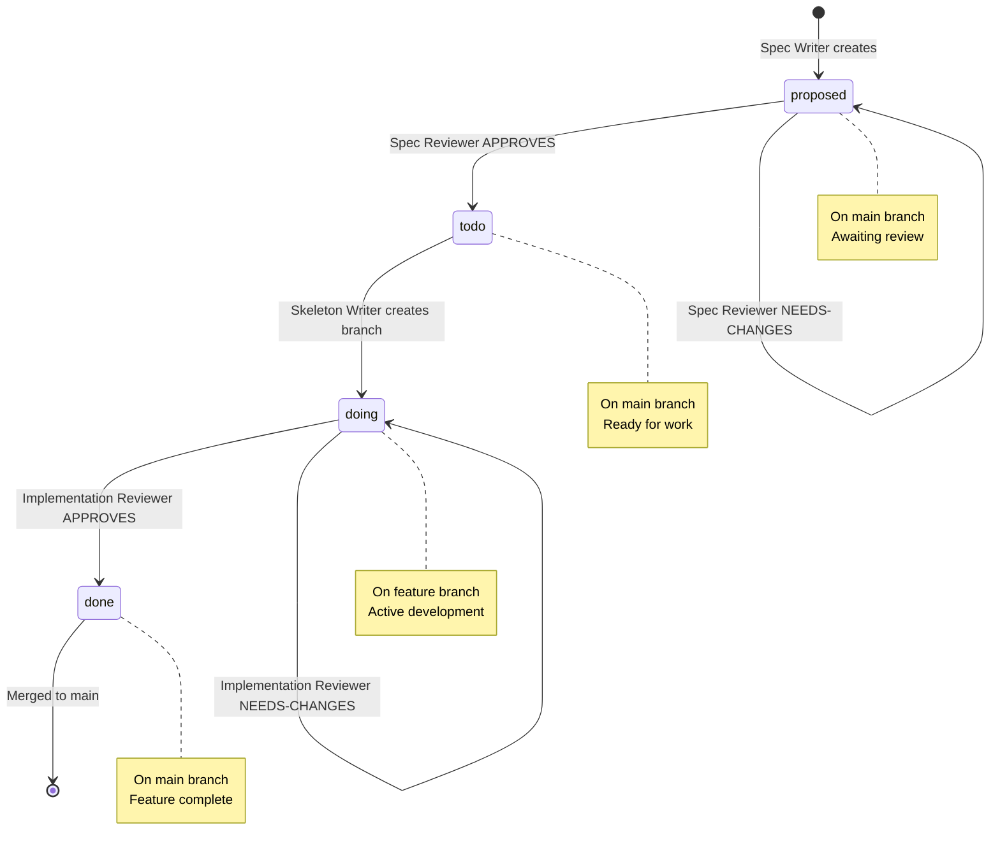
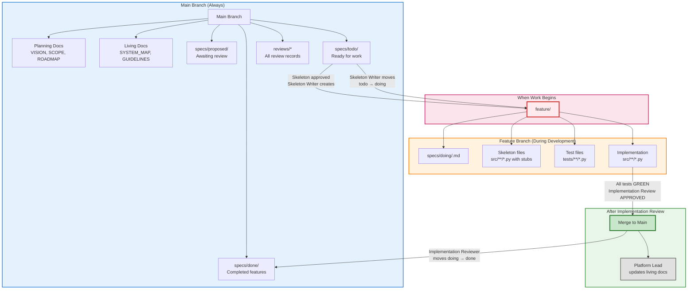
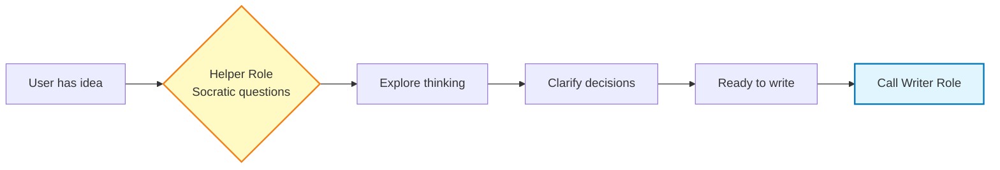
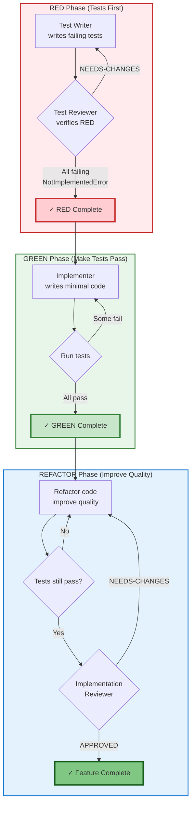
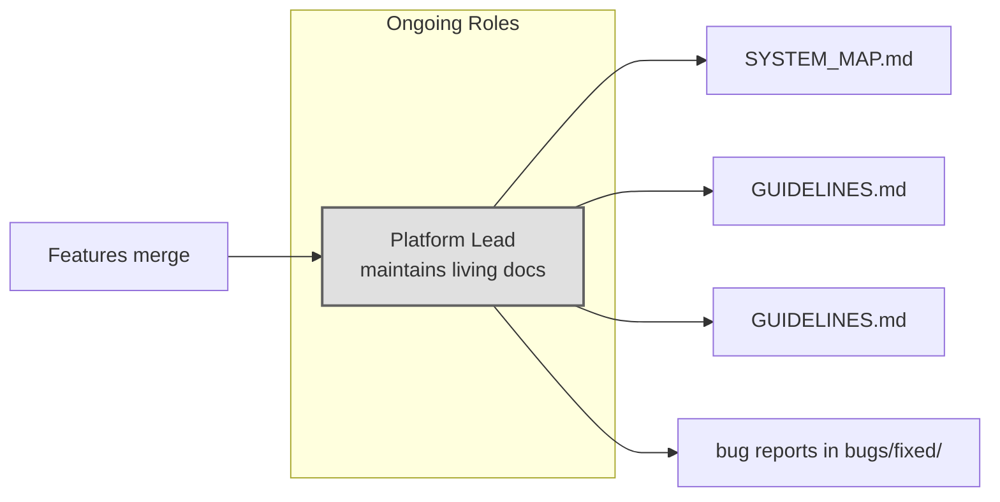
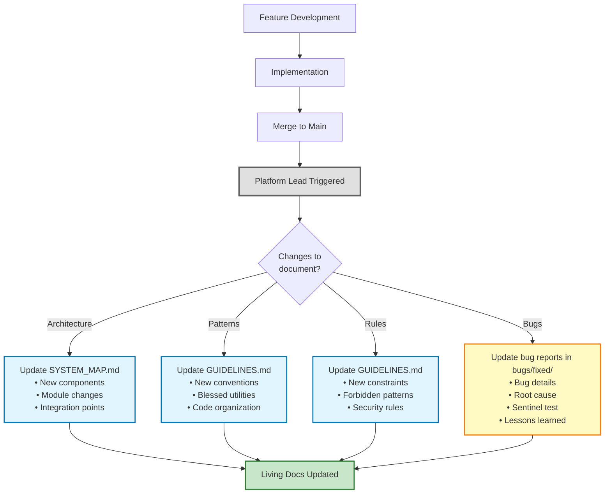
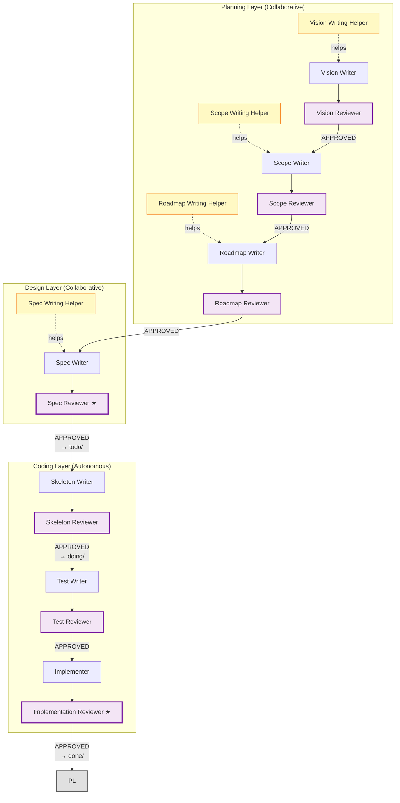

# Workflow Diagram: Complete Development Flow

Visual representation of the complete AI-augmented software development workflow, from vision to production.

## Complete Workflow Overview

```mermaid
flowchart TD
    %% Foundation Phase
    V[Vision Writer<br/>VISION.md] --> VR{Vision<br/>Reviewer}
    VR -- APPROVED --> S[Scope Writer<br/>SCOPE.md]
    VR -- NEEDS-CHANGES --> V
    
    %% Planning Phase
    S --> SR{Scope<br/>Reviewer}
    SR -- NEEDS-CHANGES --> S
    SR -- APPROVED --> R[Roadmap Writer<br/>ROADMAP.md]
    
    R --> RR{Roadmap<br/>Reviewer}
    RR -- NEEDS-CHANGES --> R
    RR -- APPROVED --> SP[Spec Writer<br/>specs/proposed/]
    
    %% Specification Phase
    SP --> SPR{Spec<br/>Reviewer}
    SPR -- NEEDS-CHANGES --> SP
    SPR -- APPROVED --> TODO[specs/todo/<br/>✓ Ready for work]
    
    %% Interface Phase
    TODO --> SKW[Skeleton Writer<br/>Creates interfaces]
    SKW --> SKR{Skeleton<br/>Reviewer}
    SKR -- NEEDS-CHANGES --> SKW
    SKR -- APPROVED --> BRANCH[Create Feature Branch<br/>Move to specs/doing/]
    
    %% TDD Phase
    BRANCH --> TW[Test Writer<br/>Write tests RED]
    TW --> TR{Test<br/>Reviewer}
    TR -- NEEDS-CHANGES --> TW
    TR -- APPROVED --> IMP[Implementer<br/>Make tests GREEN]
    
    %% Implementation Phase
    IMP --> IR{Implementation<br/>Reviewer}
    IR -- NEEDS-CHANGES --> IMP
    IR -- APPROVED --> DONE[Move to specs/done/<br/>Merge to main]
    
    %% Continuous
    DONE --> PL[Platform Lead<br/>Updates living docs]
    
    %% Styling
    style V fill:#e1f5fe,stroke:#0277bd,stroke-width:2px
    style S fill:#e1f5fe,stroke:#0277bd,stroke-width:2px
    style R fill:#e1f5fe,stroke:#0277bd,stroke-width:2px
    style SP fill:#fff3e0,stroke:#ef6c00,stroke-width:2px
    
    style VR fill:#f3e5f5,stroke:#7b1fa2,stroke-width:3px
    style SR fill:#f3e5f5,stroke:#7b1fa2,stroke-width:3px
    style RR fill:#f3e5f5,stroke:#7b1fa2,stroke-width:3px
    style SPR fill:#f3e5f5,stroke:#7b1fa2,stroke-width:3px
    style SKR fill:#f3e5f5,stroke:#7b1fa2,stroke-width:3px
    style TR fill:#f3e5f5,stroke:#7b1fa2,stroke-width:3px
    style IR fill:#f3e5f5,stroke:#7b1fa2,stroke-width:3px
    
    style TODO fill:#e8f5e9,stroke:#2e7d32,stroke-width:2px
    style BRANCH fill:#ffebee,stroke:#c62828,stroke-width:3px
    style SKW fill:#fff9c4,stroke:#f57f17,stroke-width:2px
    style TW fill:#fff9c4,stroke:#f57f17,stroke-width:2px
    style IMP fill:#fff9c4,stroke:#f57f17,stroke-width:2px
    style DONE fill:#c8e6c9,stroke:#1b5e20,stroke-width:3px
    style PL fill:#e0e0e0,stroke:#424242,stroke-width:2px
```



## Phase Breakdown

### Phase 1: Foundation (Pre-Workflow)
**Goal:** Define why the project exists

```
Vision Writer + Human → VISION.md
  ↓
Vision Reviewer → APPROVED
```

**Artifacts:**
- VISION.md (2-5 year strategic direction)

**Helper Available:** Vision Writing Helper (Socratic guidance)

---

### Phase 2: Planning (Project Setup)
**Goal:** Define what, boundaries, and delivery sequence

```
Scope Writer + Human → SCOPE.md
  ↓
Scope Reviewer → APPROVED
  ↓
Roadmap Writer + Human → ROADMAP.md
  ↓
Roadmap Reviewer → APPROVED
```

**Artifacts:**
- SCOPE.md (in/out/deferred boundaries)
- ROADMAP.md (feature sequence and phases)

**Helpers Available:** 
- Scope Writing Helper
- Roadmap Writing Helper

---

### Phase 3: Specification (Per Feature)
**Goal:** Define detailed behavioral contracts

```
Spec Writer + Human → specs/proposed/<feature>.md
  ↓
Spec Reviewer → APPROVED → moves to specs/todo/
```

**Artifacts:**
- Feature specification in `specs/todo/`
- Review record in `reviews/specs/`

**Helper Available:** Spec Writing Helper

**Gatekeeper:** Spec Reviewer controls `proposed/` → `todo/` transition

---

### Phase 4: Interface Definition
**Goal:** Create testable code structure

```
Skeleton Writer → creates interface files
  ↓
Skeleton Reviewer → APPROVED
  ↓
Skeleton Writer → creates feature branch + moves spec to specs/doing/
```

**Artifacts:**
- Code skeleton files (src/*)
- Review record in `reviews/skeletons/`
- Feature branch created
- Spec moved to `specs/doing/`

**Critical:** Skeleton Writer creates feature branch after approval

---

### Phase 5: Test-Driven Development (TDD RED)
**Goal:** Define implementation contract through tests

```
Test Writer → writes comprehensive test suite (all tests fail)
  ↓
Test Reviewer → APPROVED (verifies RED state)
```

**Artifacts:**
- Test files (tests/*)
- Review record in `reviews/tests/`
- All tests failing with NotImplementedError

**Critical:** Tests must fail before implementation begins

---

### Phase 6: Implementation (TDD GREEN/REFACTOR)
**Goal:** Make tests pass with quality code

```
Implementer → writes code to make tests pass
  ↓
Implementation Reviewer → APPROVED → moves spec to specs/done/
```

**Artifacts:**
- Production code (src/*)
- Review record in `reviews/implementations/`
- All tests passing
- Spec moved to `specs/done/`

**Gatekeeper:** Implementation Reviewer controls `doing/` → `done/` transition

**Critical:** Tests must NOT be modified during implementation

---

### Phase 7: Merge and Documentation
**Goal:** Integrate feature and update living docs

```
Merge feature branch to main
  ↓
Platform Lead → updates SYSTEM_MAP.md, GUIDELINES.md
```

**Artifacts:**
- Feature merged to main
- Living docs updated
- Feature complete!

---

## Spec State Transitions

Specifications move through four states:



### State Details

**proposed/**
- Created by Spec Writer
- Lives on main branch
- Awaits Spec Reviewer approval
- Not ready for development

**todo/**
- Moved by Spec Reviewer (gatekeeper)
- Lives on main branch
- Approved and ready for work
- Waiting for developer to start

**doing/**
- Moved by Skeleton Writer (after skeleton approval)
- Lives on feature branch
- Active development in progress
- Tests and implementation happening

**done/**
- Moved by Implementation Reviewer (gatekeeper)
- Back on main branch (after merge)
- Feature complete and shipped
- Available for use

## Branching Strategy



### Branch Policy

**Main branch contains:**
- All planning documents (VISION, SCOPE, ROADMAP)
- All living documentation (SYSTEM_MAP.md, GUIDELINES.md)
- All review records (reviews/*)
- Specs in `proposed/`, `todo/`, and `done/` states
- Never `doing/` specs (those are on feature branches)

**Feature branch created when:**
- Skeleton Reviewer approves skeleton
- Skeleton Writer creates branch: `feature/<feature-name>`
- Skeleton Writer moves spec: `todo/` → `doing/`
- Marks start of actual code development

**Feature branch contains:**
- Spec in `doing/` state
- Skeleton code (interfaces with NotImplementedError)
- Test files (comprehensive test suite)
- Implementation code (making tests pass)

**Merge to main when:**
- All tests passing (GREEN)
- Implementation Reviewer APPROVES
- Spec moved to `done/` (by Implementation Reviewer)
- No GUIDELINES.md violations
- Code quality standards met

## Review Gates Diagram

```mermaid
flowchart LR
    subgraph Planning["Planning Gates"]
        V[Vision] --> VG{Vision<br/>Reviewer}
        S[Scope] --> SG{Scope<br/>Reviewer}
        R[Roadmap] --> RG{Roadmap<br/>Reviewer}
    end
    
    subgraph Design["Design Gate"]
        SP[Spec] --> SPG{Spec<br/>Reviewer<br/>★ Gatekeeper}
    end
    
    subgraph TDD["TDD Gates"]
        SK[Skeleton] --> SKG{Skeleton<br/>Reviewer}
        T[Tests] --> TG{Test<br/>Reviewer}
        I[Implementation] --> IG{Implementation<br/>Reviewer<br/>★ Gatekeeper}
    end
    
    VG -- APPROVED --> S
    SG -- APPROVED --> R
    RG -- APPROVED --> SP
    SPG -- APPROVED<br/>→ todo/ --> SK
    SKG -- APPROVED<br/>→ doing/ --> T
    TG -- APPROVED<br/>RED verified --> I
    IG -- APPROVED<br/>→ done/ --> DONE[Merge to main]
    
    style VG fill:#f3e5f5,stroke:#7b1fa2,stroke-width:3px
    style SG fill:#f3e5f5,stroke:#7b1fa2,stroke-width:3px
    style RG fill:#f3e5f5,stroke:#7b1fa2,stroke-width:3px
    style SPG fill:#f3e5f5,stroke:#7b1fa2,stroke-width:4px
    style SKG fill:#f3e5f5,stroke:#7b1fa2,stroke-width:3px
    style TG fill:#f3e5f5,stroke:#7b1fa2,stroke-width:3px
    style IG fill:#f3e5f5,stroke:#7b1fa2,stroke-width:4px
    
    style DONE fill:#c8e6c9,stroke:#1b5e20,stroke-width:3px
```



### Gate Responsibilities

**All Reviewers:**
- Independent review (not the creator)
- Create timestamped review file
- Status: APPROVED or NEEDS-CHANGES
- Provide specific, actionable feedback

**Gatekeeper Reviewers (★):**
- Control artifact state transitions
- Move files between directories
- Spec Reviewer: `proposed/` → `todo/`
- Implementation Reviewer: `doing/` → `done/`

**Special Roles:**
- Skeleton Writer: Creates feature branch (after skeleton approval)
- Platform Lead: Updates living docs (after merge)

## Helper Roles (Optional)

Helper roles facilitate planning through Socratic conversation:



**Available Helpers:**
- Vision Writing Helper → Vision Writer
- Scope Writing Helper → Scope Writer
- Roadmap Writing Helper → Roadmap Writer
- Spec Writing Helper → Spec Writer

**When to use:**
- Requirements unclear
- First-time user
- Complex decisions
- Exploratory thinking

## TDD Cycle Detail



### TDD Critical Rules

**RED Phase:**
- Tests written BEFORE implementation
- All tests MUST fail initially
- Fail with NotImplementedError (correct reason)
- Test Reviewer verifies RED state

**GREEN Phase:**
- Write minimal code to make tests pass
- No test modifications allowed
- Run tests frequently
- If test seems wrong → flag for re-review

**REFACTOR Phase:**
- Improve code quality
- Tests must stay green
- No new functionality
- Implementation Reviewer ensures quality

## Support Roles (Continuous)



**Platform Lead:**
- Triggered after feature merge
- Updates SYSTEM_MAP (architecture changes)
- Updates GUIDELINES.md (new patterns emerge)
- Updates GUIDELINES.md (new constraints)
- Updates GUIDELINES.md (patterns discovered)
- Updates bug documentation (bugs/fixed/)

## Living Documentation Flow



## Complete Role Interaction Map



**Legend:**
- ★ = Gatekeeper (controls artifact state transitions)
- Solid arrows = Primary workflow
- Dashed arrows = Support/help relationships

---

**Total roles:** 20 (18 primary + 2 support)
**Review gates:** 7 (Vision, Scope, Roadmap, Spec, Skeleton, Test, Implementation)
**Gatekeepers:** 2 (Spec Reviewer, Implementation Reviewer)
**Helpers:** 4 (Vision, Scope, Roadmap, Spec)
