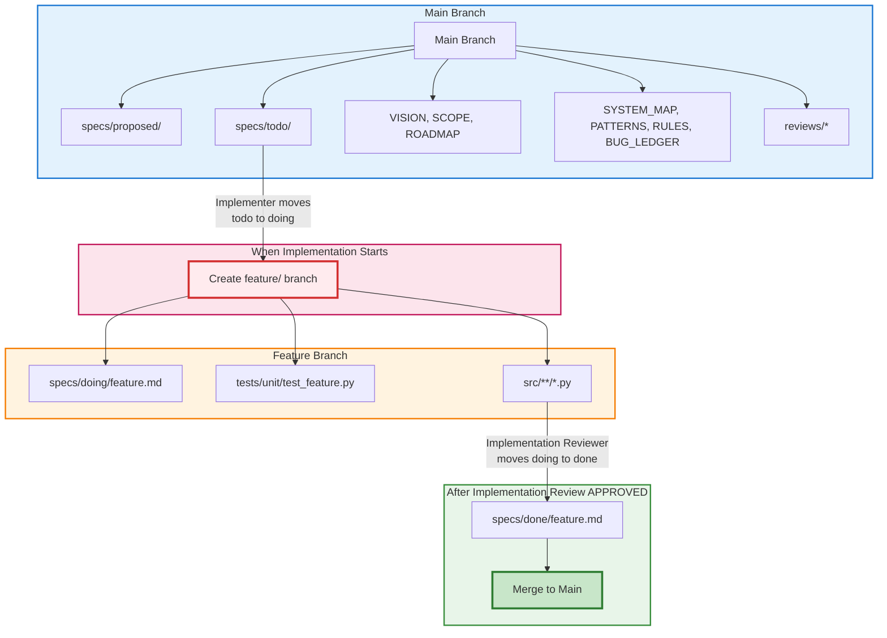
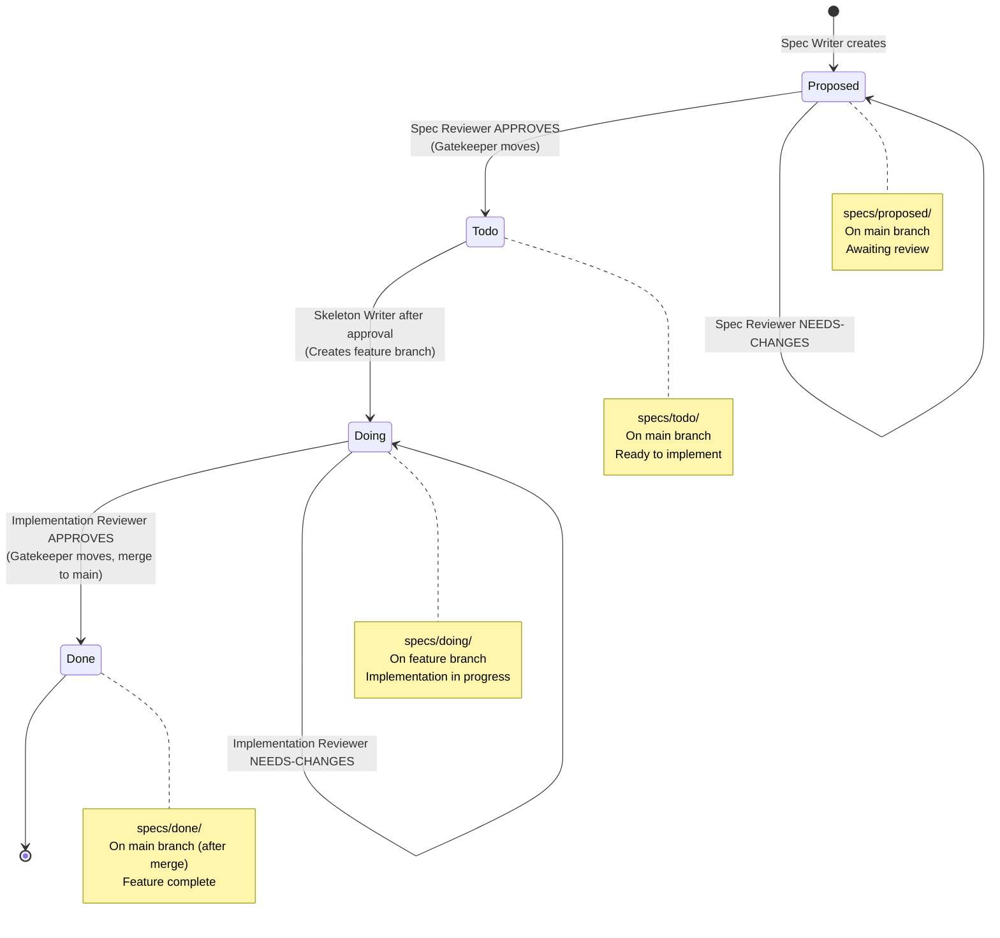
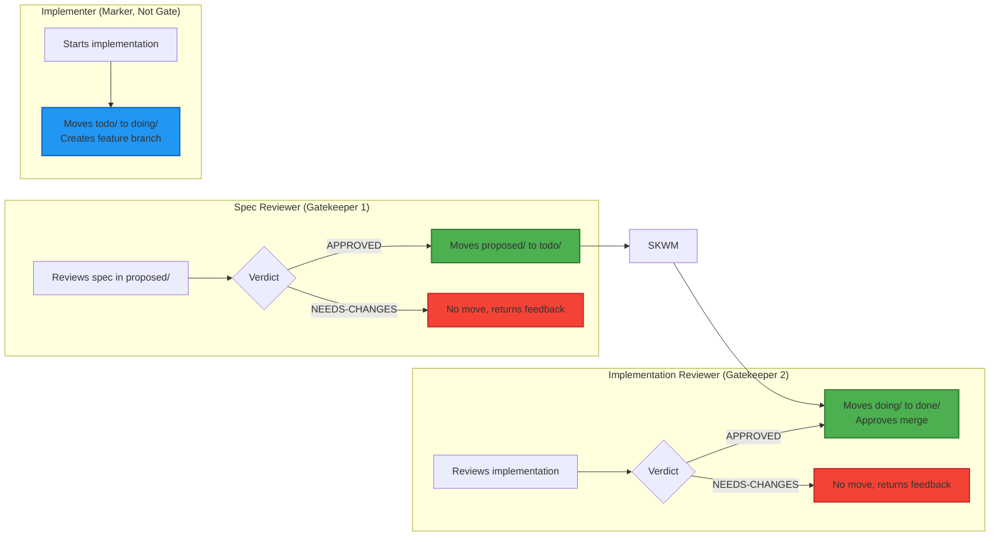
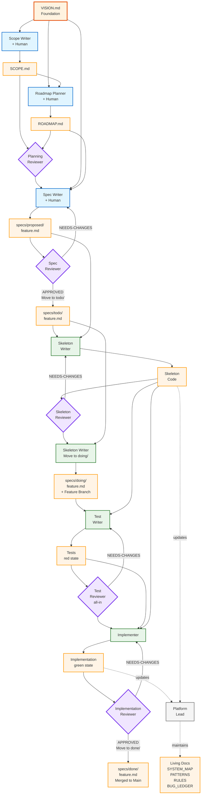

# Workflow Diagram: Feature Development Flow

Visual representation of the AI-augmented software development workflow, showing the role of the Spec Reviewer gate, gatekeeper movements, and branching strategy.

## Complete Feature Flow with Spec Review Gate

```mermaid
flowchart LR
    A[Write Spec<br/>specs/proposed/] --> B{Spec Review<br/>reviews/specs/...}
    B -- APPROVED --> C[Move to specs/todo/<br/>Gatekeeper: Spec Reviewer]
    B -- NEEDS-CHANGES --> A
    
    C --> D[Start Implementation<br/>move todo to doing by Implementer<br/>CREATE FEATURE BRANCH]
    
    D --> E[Write Tests<br/>tests/unit/test_feature.py]
    E --> F{Test Review all-in<br/>reviews/tests/...}
    F -- NEEDS-CHANGES --> E
    F -- APPROVED --> G[Implementation]
    
    G --> H{Implementation Review<br/>reviews/implementations/...}
    H -- NEEDS-CHANGES --> G
    H -- APPROVED --> I[Move to specs/done/<br/>Gatekeeper: Implementation Reviewer<br/>MERGE TO MAIN]
    
    style A fill:#fff4e6,stroke:#ff9800,stroke-width:2px
    style C fill:#e1f5ff,stroke:#0066cc,stroke-width:2px
    style D fill:#ffe6f0,stroke:#d32f2f,stroke-width:2px
    style E fill:#fff4e6,stroke:#ff9800,stroke-width:2px
    style G fill:#fff4e6,stroke:#ff9800,stroke-width:2px
    style I fill:#e8f5e9,stroke:#2e7d32,stroke-width:2px
    
    style B fill:#f0e6ff,stroke:#7c3aed,stroke-width:3px
    style F fill:#f0e6ff,stroke:#7c3aed,stroke-width:3px
    style H fill:#f0e6ff,stroke:#7c3aed,stroke-width:3px
```



### Flow Explanation

1. **Spec Writer** creates spec in `specs/proposed/`
2. **Spec Reviewer** reviews and creates a timestamped review
   - If APPROVED: **Gatekeeper moves** `proposed/` to `todo/`
   - If NEEDS-CHANGES: Returns to Spec Writer
3. **Implementer** moves `todo/` to `doing/` and creates feature branch
4. **Test Writer** creates comprehensive test suite
5. **Test Reviewer** reviews entire suite (all-in)
   - If APPROVED: Proceed to implementation
   - If NEEDS-CHANGES: Returns to Test Writer
6. **Implementer** makes tests pass
7. **Implementation Reviewer** reviews code
   - If APPROVED: **Gatekeeper moves** `doing/` to `done/`, merges to main
   - If NEEDS-CHANGES: Returns to Implementer

## Branching Strategy



### Branch Policy Summary

**Main branch contains:**
- All planning docs (VISION, SCOPE, ROADMAP)
- All living docs (SYSTEM_MAP, PATTERNS, RULES, BUG_LEDGER)
- All review records (reviews/*)
- Specs in `proposed/` and `todo/` states only

**Feature branch created when:**
- Implementer moves spec from `todo/` to `doing/`
- Marks the actual start of coding work
- Named: `feature/<feature-name>`

**Feature branch contains:**
- Spec in `doing/` state
- Test files (tests/*)
- Implementation code (src/*)

**Merge trigger:**
- Implementation Reviewer approves
- All tests passing (green state)
- Spec moved to `done/`
- Feature complete

## Spec State Machine



## Gatekeeper Responsibilities



### Gatekeeper Rules

**Spec Reviewer (proposed to todo):**
- ONLY moves specs when review status is APPROVED
- Creates `reviews/specs/YYYY-MM-DDTHH-MM-SS-<feature>-APPROVED.md`
- On NEEDS-CHANGES: spec stays in `proposed/`, no movement

**Implementer (todo to doing):**
- Not a review gate, just marking start of work
- Creates feature branch at this point
- No approval needed, just starting implementation

**Implementation Reviewer (doing to done):**
- ONLY moves specs when review status is APPROVED
- Creates `reviews/implementations/YYYY-MM-DDTHH-MM-SS-<feature>-APPROVED.md`
- On NEEDS-CHANGES: spec stays in `doing/`, no movement
- Approval also gates merge to main

## Review Filename Convention

All reviews follow this pattern:
```
reviews/<type>/YYYY-MM-DDTHH-MM-SS-<feature>-<STATUS>.md
```

**Components:**
- `<type>`: planning | specs | skeletons | tests | implementations
- Timestamp: ISO 8601 with seconds (e.g., `2025-01-23T14-30-47`)
- `<feature>`: kebab-case feature name
- `<STATUS>`: APPROVED | NEEDS-CHANGES

**Examples:**
- `reviews/specs/2025-01-23T09-15-30-user-auth-APPROVED.md`
- `reviews/tests/2025-01-24T14-30-47-weather-cache-NEEDS-CHANGES.md`
- `reviews/implementations/2025-01-25T16-45-22-user-auth-APPROVED.md`

## Complete Workflow with All Roles



### Role Type Legend

- **Foundation** (orange, thick border): Pre-workflow document
- **Collaborative** (blue): Human + Agent working together
- **Autonomous** (green): Agent working independently
- **Review** (purple, thick border): Independent review gates
- **Artifact** (amber): Documents and code produced
- **Support** (gray): Ongoing/on-demand roles

## Key Workflow Principles Illustrated

1. **Spec Review Gate**: Formal approval before implementation planning begins
2. **Gatekeeper Movements**: Specific roles responsible for moving specs between states
3. **Branching at Doing**: Feature branches created when implementation actually starts
4. **TDD Red-Green**: Tests written and failing before implementation
5. **All-In Test Review**: Complete suite reviewed as single unit
6. **Test Immutability**: Implementation cannot modify tests
7. **Living Docs**: Continuously maintained throughout workflow

## Common Workflow Patterns

### Happy Path (No Revisions)
```
Spec Writer -> proposed/ 
-> Spec Reviewer APPROVED -> todo/
-> Implementer -> doing/ + feature branch
-> Test Writer -> tests (red)
-> Test Reviewer APPROVED
-> Implementer -> code (green)
-> Implementation Reviewer APPROVED -> done/ + merge
```

### With Revision Cycles
```
Spec Writer -> proposed/
-> Spec Reviewer NEEDS-CHANGES
-> Spec Writer (revise) -> proposed/
-> Spec Reviewer APPROVED -> todo/
...
-> Test Writer -> tests (red)
-> Test Reviewer NEEDS-CHANGES
-> Test Writer (fix) -> tests (red)
-> Test Reviewer APPROVED
...
-> Implementation Reviewer NEEDS-CHANGES
-> Implementer (fix) -> code (green)
-> Implementation Reviewer APPROVED -> done/ + merge
```

## Tool Support

The workflow can be enforced with:
- **Git hooks**: Prevent direct pushes to certain dirs
- **CI/CD**: Verify review files exist before merges
- **Scripts**: Automate gatekeeper movements
- **Linters**: Check file naming conventions

## Quick Reference Commands

### Spec Reviewer (Gatekeeper)
```bash
# On APPROVED review
git mv specs/proposed/feature.md specs/todo/feature.md
git add reviews/specs/2025-01-23T14-30-47-feature-APPROVED.md
git commit -m "spec: approve feature specification"
```

### Skeleton Writer (After Approval)
```bash
# After skeleton approval, moving to doing state
git checkout -b feature/feature-name
git mv specs/todo/feature.md specs/doing/feature.md
git commit -m "feat: start development of feature

- Skeleton code approved and on feature branch
- Ready for test writing phase"
```

### Implementation Reviewer (Gatekeeper)
```bash
# On APPROVED review
git mv specs/doing/feature.md specs/done/feature.md
git add reviews/implementations/2025-01-25T16-45-22-feature-APPROVED.md
git commit -m "impl: approve feature implementation"
git checkout main
git merge feature/feature-name
```

## Notes

- All diagrams show forward flow only (revision loops simplified)
- Timestamps in examples use ISO 8601 format with seconds
- Feature branches created at `doing` state, not `todo` state
- Reviews accumulate (history preserved) with timestamped filenames
- Living docs (SYSTEM_MAP, etc.) updated continuously, not just at gates
